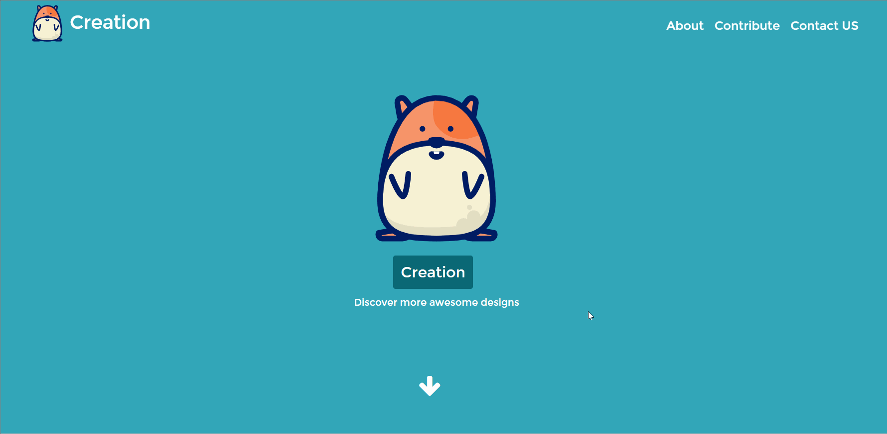

#Create|发掘无限创作可能

## 创作目的

这是一个集合了大家创意的站点。在这里，我们可以看到参与Web前端开发这门课的同学们的心血，看到他们的成长，看到他们的热爱，看到他们的无限创意！虽然这个展示站点是如此简陋，但是同学们的站点却是如此丰富而充满创造力的，希望大家尽情欣赏吧！

##结构功能

* 提交作品
* 展示所有作品，包括展示详情页
* 展示作品排行榜，对作品点赞
* 收藏喜欢的作品

## 技术细节

* 通过监听浏览器窗口大小实现首页banner图片始终全屏
* 通过监听滚动位置实现导航栏的改变
* 布局：position+float传统布局方式，含有一些display：inline-block和清除浮动等tricks
* 图标采用iconfont
* -webkit-scrollbar样式改变了滚动栏，使网页更加美化
* 利用伪类实现排行榜上的一些效果
* 对卡片的边缘做了一些滑动变色效果
* 实现了整站页面的模板化，通过ajax获取模板内容，渲染到页面上
* 使用location来获取当前url参数，实现不同页面采用不同模板和一些特定效果，该效果仅用一个函数可实现，参数为模板名
* 用js控制一些效果的display属性，在我的收藏栏目实现一些特定效果
* 提交页面用潜入submit.php（用bootstrap实现表单的样式效果），提交至数据库，再由getdata.php取出并生成json字符串
* 在网站获取数据时采用ajax同步方式获取getdata.php的json字符串，同时循环取出json字符串时使用了递归调用以解决使用ajax造成了一些异步问题
* 使用sessionstorage来存储取回的数据
* 在排行榜页面实现了一个按star值排序函数
* 在模板中嵌入占位符，从而将取回的数据放置在正确的地方
* 对于详情页，通过一个函数来获取url参数从而实现不同的账号显示不同的详情页

